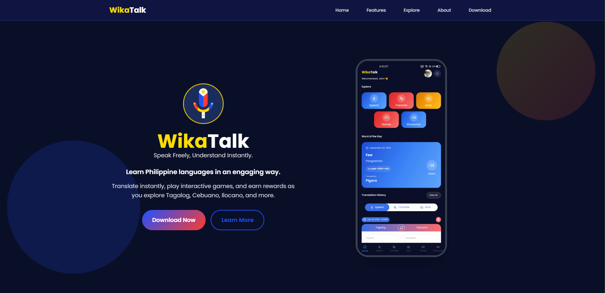

# WikaTalk - Filipino Dialect Speech Interpreter 🇵🇭

<div align="center">
  
  
  **Bridging Filipino Communities Through Language Technology**
  
  [](https://github.com/Adrian9502/wikatalk-thesis-speech-interpreter/releases)
  [](https://reactnative.dev/)
  [](https://expo.dev/)
  [](https://nodejs.org/)
  [](https://mongodb.com/)
  [](#license)
</div>

## 🌐 See and Download App Here

<div align="center">
  <a href="https://wikatalk.vercel.app" target="_blank">
    
  </a>
  
  **[Visit WikaTalk Web App →](https://wikatalk.vercel.app)**
</div>

## 📖 Table of Contents

- [About](#about)
- [Features](#features)
- [Supported Languages](#supported-languages)
- [Tech Stack](#tech-stack)
- [Project Structure](#project-structure)
- [Installation](#installation)
- [Configuration](#configuration)
- [Usage](#usage)
- [API Documentation](#api-documentation)
- [Development](#development)
- [Testing](#testing)
- [Deployment](#deployment)
- [Contributing](#contributing)
- [Academic Context](#academic-context)
- [Team](#team)
- [License](#license)
- [Contact](#contact)

## 🌟 About

**WikaTalk** is an innovative Filipino dialect speech interpreter that bridges communication gaps across the diverse linguistic landscape of the Philippines. Developed as an undergraduate thesis project, this application combines cutting-edge speech recognition, natural language processing, and gamified learning to preserve and promote Filipino cultural heritage.

### 🎯 Mission

To empower Filipino communities worldwide by providing accessible, accurate, and culturally-aware translation services that celebrate the rich diversity of Philippine languages.

### 🏆 Key Achievements

- **10+ Filipino Dialects** supported with high accuracy
- **Gamified Learning System** with 150+ interactive levels
- **Real-time Translation** across speech, text, and visual input
- **Cultural Preservation** through interactive educational content

## ✨ Features

### 🗣️ Translation Capabilities

- **Speech-to-Speech Translation**: Real-time voice translation between dialects
- **Text Translation**: Instant text conversion with confidence scoring
- **Camera OCR**: Translate text from images and documents
- **Quick Phrases**: Pre-defined common expressions for each dialect
- **Translation History**: Encrypted storage with offline access

### 🎮 Gamified Learning

- **Interactive Games**: Multiple Choice, Word Identification, Fill-in-the-Blank
- **Progressive Levels**: 150 levels across 3 difficulty tiers
- **Rewards System**: Coins, hints, and achievement tracking
- **Daily Challenges**: Word of the Day with pronunciation guides
- **Leaderboards**: Community rankings and progress sharing

### 🔧 Advanced Features

- **Multi-input Support**: Voice, text, and camera input methods
- **Offline Capabilities**: Core features work without internet
- **Theme Customization**: Multiple color schemes and accessibility options
- **Tutorial System**: Interactive onboarding for all features
- **Progress Tracking**: Detailed analytics and learning insights

## 🌏 Supported Languages

| Language    | Code | Accuracy Rate | Status             |
| ----------- | ---- | ------------- | ------------------ |
| Tagalog     | tl   | 92.5%         | ✅ Fully Supported |
| Cebuano     | ceb  | 89.8%         | ✅ Fully Supported |
| Hiligaynon  | hil  | 92.71%        | ✅ Fully Supported |
| Ilocano     | ilo  | 87.3%         | ✅ Fully Supported |
| Bicol       | bcl  | 85.6%         | ✅ Fully Supported |
| Waray       | war  | 88.1%         | ✅ Fully Supported |
| Pangasinan  | pag  | 84.2%         | ✅ Fully Supported |
| Maguindanao | mdh  | 81.7%         | ✅ Fully Supported |
| Kapampangan | pam  | 76.33%        | ✅ Fully Supported |
| Bisaya      | bis  | 90.4%         | ✅ Fully Supported |

## 🛠️ Tech Stack

### Frontend (Mobile App)

- **Framework**: React Native 0.74.5 with Expo 51.0.28
- **Navigation**: Expo Router with file-based routing
- **State Management**: Zustand for global state
- **UI Components**: React Native Elements, Paper
- **Animations**: React Native Reanimated 3
- **Audio**: Expo AV for recording and playback
- **Camera**: Expo Camera with OCR capabilities

### Backend (API Server)

- **Runtime**: Node.js 20+ with Express.js
- **Database**: MongoDB with Mongoose ODM
- **Authentication**: JWT with Google OAuth integration
- **Security**: bcrypt, express-rate-limit, helmet
- **File Upload**: Multer with cloud storage
- **Email**: Nodemailer with HTML templates

### Web (Landing Page)

- **Framework**: React 18 with TypeScript
- **Build Tool**: Vite for fast development
- **Styling**: Tailwind CSS with custom animations
- **Animations**: Framer Motion
- **Icons**: React Icons (Feather, FontAwesome)

### DevOps & Deployment

- **Hosting**: Vercel (Backend), Expo Application Services
- **Database**: MongoDB Atlas
- **CI/CD**: GitHub Actions
- **Monitoring**: Custom analytics and error tracking

## 📁 Project Structure

```
wikatalk-speech-interpreter/
├── app/                          # React Native Mobile Application
│   ├── app/                      # App routes (Expo Router)
│   │   ├── (auth)/              # Authentication screens
│   │   ├── (tabs)/              # Main app tabs
│   │   ├── (settings)/          # Settings screens
│   │   └── (games)/             # Game screens
│   ├── components/              # Reusable UI components
│   ├── store/                   # Zustand state management
│   ├── hooks/                   # Custom React hooks
│   ├── services/                # API services
│   └── utils/                   # Utility functions
├── backend/                     # Express.js API Server
│   ├── controllers/             # Route controllers
│   ├── models/                  # MongoDB models
│   ├── routes/                  # API routes
│   ├── services/                # Business logic services
│   ├── middleware/              # Custom middleware
│   └── utils/                   # Server utilities
├── web/                         # React Landing Page
│   ├── src/
│   │   ├── components/          # React components
│   │   ├── constants/           # App constants
│   │   └── assets/              # Static assets
│   └── public/                  # Public assets
└── README.md                    # This file
```

## 🚀 Installation

### Prerequisites

- Node.js 20 or higher
- npm or yarn package manager
- MongoDB instance (local or Atlas)
- Expo CLI (for mobile development)
- Git

### 1. Clone the Repository

```bash
git clone https://github.com/Adrian9502/wikatalk-thesis-speech-interpreter.git
cd wikatalk-speech-interpreter
```

### 2. Backend Setup

```bash
cd backend
npm install

# Create environment file
cp .env.example .env
# Edit .env with your configuration

# Start the server
npm start
```

### 3. Mobile App Setup

```bash
cd ../app
npm install

# Create environment file
cp .env.example .env
# Edit .env with your configuration

# Start Expo development server
npx expo start
```

### 4. Web Landing Page Setup

```bash
cd ../web
npm install

# Create environment file
cp .env.example .env
# Edit .env with your configuration

# Start development server
npm run dev
```

## ⚙️ Configuration

### Backend Environment Variables

```env
# Database
MONGODB_URI=mongodb://localhost:27017/wikatalk
DB_NAME=wikatalk

# Authentication
JWT_SECRET=your-jwt-secret-key
GOOGLE_CLIENT_ID=your-google-client-id
GOOGLE_CLIENT_SECRET=your-google-client-secret

# Email Service
EMAIL_USER=your-email@gmail.com
EMAIL_PASSWORD=your-app-password

# Encryption
ENCRYPTION_KEY=your-32-character-encryption-key

# Server
PORT=3000
NODE_ENV=development
```

### Mobile App Environment Variables

```env
# API Configuration
EXPO_PUBLIC_API_URL=http://localhost:3000
EXPO_PUBLIC_WEB_CLIENT_ID=your-google-web-client-id

# App Configuration
EXPO_PUBLIC_APP_VARIANT=development
```

### Web Environment Variables

```env
# API Configuration
VITE_API_URL=http://localhost:3000
```

## 📱 Usage

### For End Users

#### Download the App

- **Android**: [Download APK](https://github.com/Adrian9502/wikatalk-thesis-speech-interpreter/releases/download/v1.5.0/wikatalk-v1.5.0.apk)
- **iOS**: Coming soon to App Store

#### Getting Started

1. **Create Account**: Sign up with email or Google account
2. **Complete Tutorial**: Follow the interactive onboarding
3. **Start Translating**: Use voice, text, or camera input
4. **Play Games**: Earn coins and improve your skills
5. **Track Progress**: Monitor your learning journey

### For Developers

#### Running Tests

```bash
# Backend tests
cd backend
npm test

# Frontend tests
cd app
npm test
```

#### Building for Production

```bash
# Build mobile app
cd app
npx expo build:android
npx expo build:ios

# Build web app
cd web
npm run build
```

## 📚 API Documentation

### Authentication Endpoints

```
POST /api/auth/register       # User registration
POST /api/auth/login          # User login
POST /api/auth/google         # Google OAuth
POST /api/auth/refresh        # Refresh token
POST /api/auth/logout         # User logout
```

### Translation Endpoints

```
POST /api/translate           # Text translation
POST /api/translate/speech    # Speech translation
GET  /api/translate/history   # Translation history
DELETE /api/translate/:id     # Delete translation
```

### Game Endpoints

```
GET  /api/games/levels        # Get game levels
POST /api/games/score         # Submit score
GET  /api/games/progress      # Get progress
GET  /api/quiz/questions      # Get quiz questions
```

### User Endpoints

```
GET  /api/user/profile        # Get user profile
PUT  /api/user/profile        # Update profile
GET  /api/user/progress       # Get user progress
DELETE /api/user/account      # Delete account
```

## 🔧 Development

### Code Style Guidelines

- **ESLint**: Enforced linting rules
- **Prettier**: Consistent code formatting
- **TypeScript**: Type safety throughout
- **Conventional Commits**: Standardized commit messages

### Development Workflow

1. **Feature Branch**: Create feature branches from `main`
2. **Development**: Implement features with tests
3. **Code Review**: Submit pull requests for review
4. **Testing**: Ensure all tests pass
5. **Deployment**: Merge to main triggers deployment

### Debugging

```bash
# Enable debug logs
DEBUG=wikatalk:* npm start

# View logs in Expo
npx expo logs
```

## 🧪 Testing

### Unit Tests

```bash
# Run all tests
npm test

# Run with coverage
npm run test:coverage

# Watch mode
npm run test:watch
```

### Integration Tests

```bash
# API integration tests
npm run test:integration

# E2E tests
npm run test:e2e
```

## 🌐 Deployment

### Backend Deployment (Vercel)

```bash
# Install Vercel CLI
npm i -g vercel

# Deploy
vercel --prod
```

### Mobile App Deployment (EAS)

```bash
# Install EAS CLI
npm install -g @expo/eas-cli

# Build for production
eas build --platform android --profile production
eas build --platform ios --profile production

# Submit to stores
eas submit --platform android
eas submit --platform ios
```

### Web Deployment (Vercel)

```bash
cd web
vercel --prod
```

### Development Setup

1. Fork the repository
2. Create a feature branch
3. Make your changes
4. Add tests for new features
5. Submit a pull request

## 🎓 Academic Context

This application was developed as an undergraduate thesis project for the degree of **Bachelor of Science in Computer Science** at **City College of Calamba**, Academic Year 2025–2026.

### Research Focus

- **Language Technology**: Advancing Filipino dialect processing
- **Cultural Preservation**: Digital preservation of linguistic heritage
- **Educational Technology**: Gamified language learning approaches
- **Mobile Computing**: Cross-platform app development

## 👥 Team

<div align="center">

### Lead Developer & Researcher

**John Adrian Bonto**  
_Full Stack Developer_  
Responsible for the full development of the mobile application using React Native, Express.js, and MongoDB. Tasks included user interface design, back-end integration, API implementation, and overall system architecture.  
📧 bontojohnadrian@gmail.com  
🔗 [GitHub](https://github.com/Adrian9502) • [LinkedIn](https://www.linkedin.com/in/john-adrian-bonto-a65704283/) • [Facebook](https://www.facebook.com/john.adrian.bonto)

---

### NLP Engineer / Machine Learning Specialist

**Ronald Curzon**  
In charge of training and fine-tuning the Natural Language Processing model using Hugging Face and Google Colab. Also contributed to the mobile application’s development through collaborative implementation and version control via GitHub.  
📧 curzonronald@gmail.com  
🔗 [GitHub](https://github.com/rbcurzon) • [LinkedIn](https://www.linkedin.com/in/ronald-curzon-928250309) • [Facebook](https://www.facebook.com/rbcurzon)

---

### Research & Documentation Lead

**Hannie Edrielle Marababol**  
Primary author of the thesis manuscript. Oversaw the formulation of the research framework, literature review, and methodology, ensuring alignment with academic standards and project goals.  
🔗 [Facebook](https://www.facebook.com/share/18erkKAGeG/?mibextid=wwXIfr)

---

### Research & Documentation Assistant

**Christian Almazan**  
Assisted in the preparation and organization of project documentation. Contributed to the thesis manuscript through research support, editing, and formatting in coordination with the lead researcher.  
🔗 [Facebook](https://www.facebook.com/share/1BitbvHQXs/)

</div>

### Special Thanks

- City College of Calamba Faculty
- Filipino Language Consultants
- Beta Testing Community
- Open Source Contributors

## 📄 License

This project is developed for **academic purposes** as part of an undergraduate thesis.

### Academic Use License

- ✅ Educational and research use
- ✅ Personal learning and study
- ✅ Academic citation and reference
- ❌ Commercial use without permission
- ❌ Redistribution without attribution

For commercial licensing inquiries, please contact the development team.

## 📞 Contact

### Support & Feedback

- **Email**: bontojohnadrian@gmail.com
- **App Support**: Use the in-app contact feature
- **Issues**: [GitHub Issues](https://github.com/Adrian9502/wikatalk-thesis-speech-interpreter/issues)

### Academic Inquiries

For academic collaboration, research partnerships, or thesis-related questions:

- **Institution**: City College of Calamba
- **Department**: Computer Science
- **Email**: bontojohnadrian@gmail.com

---

<div align="center">
  <h3>🇵🇭 Preserving Filipino Heritage Through Technology 🇵🇭</h3>
  
  **WikaTalk** - *Where Every Voice Matters*
  
  Made with ❤️ for the Filipino Community
  
  [](https://github.com/Adrian9502/wikatalk-thesis-speech-interpreter/stargazers)
  [](https://github.com/Adrian9502)
</div>
